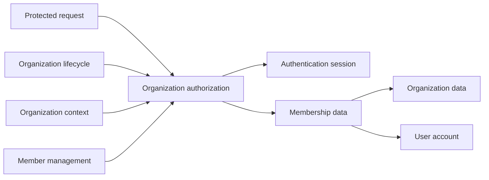
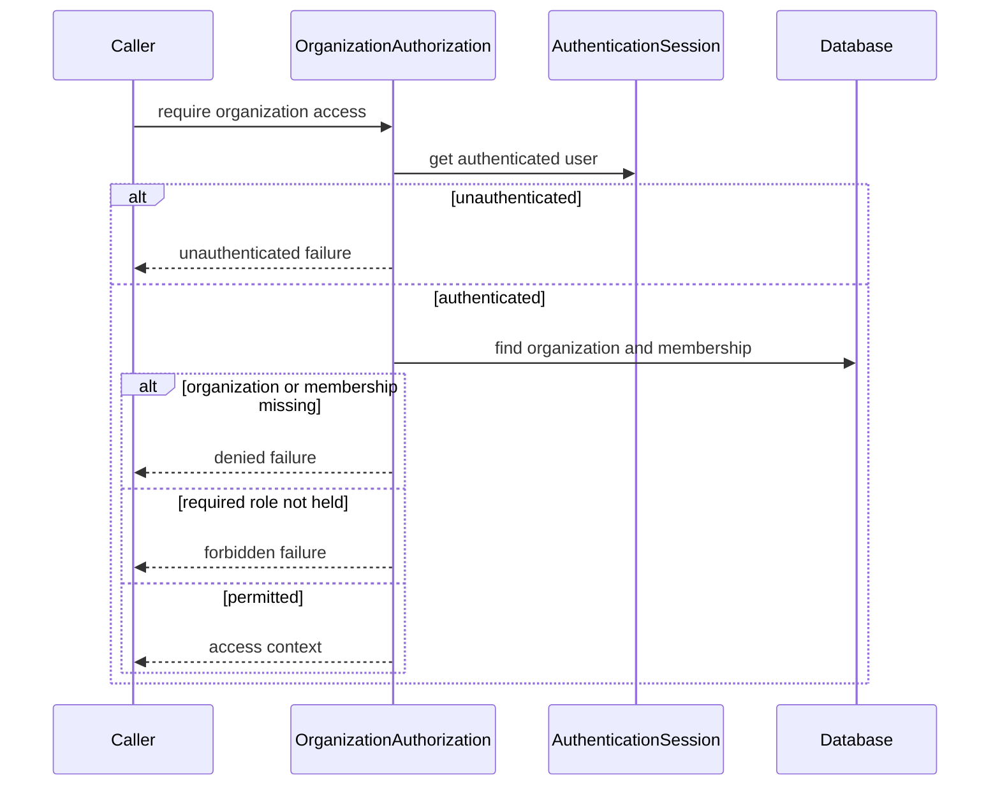
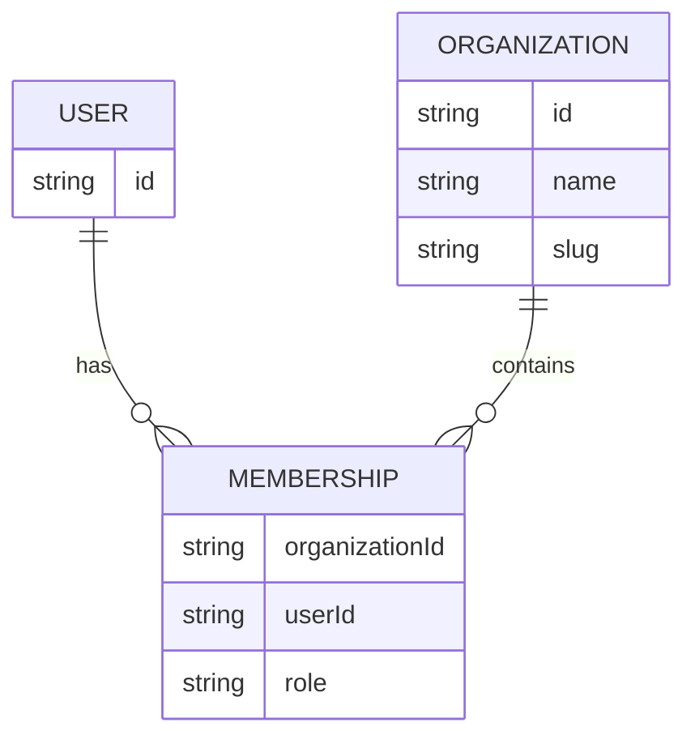
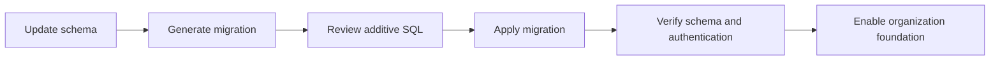

# Technical Design: Organization Foundation

## Overview

本設計は、認証済みユーザアカウントを組織へ関連付け、組織単位の操作を安全に認可する基盤を追加する。Better Auth は既存どおりユーザアカウントの認証とセッションを担当し、organization プラグインは使用しない。アプリケーションが organization、membership、`owner`、`member` を独自に管理する。

利用者は後続仕様を通じて組織機能を利用する。本仕様は画面、組織作成、招待を提供せず、後続仕様が一貫して利用するデータ契約、認可契約、移行契約を提供する。

### Goals

- organization と membership の識別可能で整合した永続モデルを追加する。
- `owner` と `member` だけを許可する組織ロール契約を確立する。
- 保護された組織操作のための、再利用可能で fail-closed なサーバー側認可境界を提供する。
- 既存の認証、メール検証、二段階認証、セッションを維持する。
- canonical な認証 base URL と信頼済みプロキシの運用境界を確立する。

### Non-Goals

- 組織作成、招待、招待の状態遷移、メンバー操作、組織ルーティングの実装。
- 組織に属する業務データやテナント単位のデータ可視性。
- `owner` と `member` 以外のロール、監査ログ、課金、外部IdP連携。

## Boundary Commitments

### This Spec Owns

- organization と membership のデータ定義、参照整合性、組織内で一意な所属の不変条件。
- `owner`/`member` のロール型と、これら以外を保存・認可しない制約。
- 認証済みアカウント、組織存在、membership、必要ロールを確認するサーバー専用認可契約。
- 既存認証データを保持する加算的 migration と、認証の canonical base URL 設定。

### Out of Boundary

- 組織・membership・招待レコードを作成または変更するユーザー操作。これらは organization-lifecycle と organization-member-management が担う。
- URL slug からアクティブ組織を解決すること、および組織ページのガード。これらは organization-context が担う。
- 招待の送信・受諾・期限・通知、業務データの組織分離。

### Allowed Dependencies

- `src/lib/auth.ts` の Better Auth セッション取得と既存ユーザアカウント。
- `src/db/index.ts` の共有 Drizzle インスタンスと PostgreSQL。
- `src/db/schema.ts` の既存 `user` テーブル。
- 環境変数で構成する canonical URL と、プラットフォームで制御されたプロキシ転送ヘッダー。

### Revalidation Triggers

- organization または membership の識別子、slug、一意制約、削除規則を変更する場合。
- role の許可値または `requireOrganizationAccess` の成功・失敗契約を変更する場合。
- 認可境界がクライアント実行可能になる、またはセッション以外の認証情報を受け入れる場合。
- canonical URL、プロキシ、認証初期化の前提を変更する場合。

## Architecture

### Existing Architecture Analysis

既存の認証は `src/lib/auth.ts` に集約され、Drizzle adapter と `src/db/schema.ts` の認証テーブルを使用する。保護ページはリクエストヘッダーから Better Auth セッションを取得するが、組織・所属・ロールの照会は存在しない。既存の認証ルートと認証クライアントは組織ロジックを持たない状態を維持する。

### Architecture Pattern & Boundary Map



- **Selected pattern**: Drizzle schema とサーバー専用の認可モジュールを組み合わせる最小構成とする。
- **Dependency direction**: Schema types → database → authentication session → organization authorization → lifecycle/context/management。右側の後続機能は左側だけを参照し、foundation は後続仕様の画面や招待ロジックを参照しない。
- **New component rationale**: `organization-authz.ts` は組織操作の認可に必要な照会・失敗分類を集約する。個別の repository、API、クライアント状態は本仕様では追加しない。

### Technology Stack

| Layer | Choice / Version | Role in Feature | Notes |
| --- | --- | --- | --- |
| Backend | Next.js 16 server runtime | 認可モジュールをサーバーだけで実行する | クライアントへ DB照会を公開しない |
| Authentication | Better Auth 1.7.3 | ユーザアカウントとセッションの認証 | organization プラグインは使用しない |
| Data | PostgreSQL 16 and Drizzle ORM | organization と membership の永続化と migration | 既存テーブルへ加算する |
| Testing | Vitest | スキーマ契約と認可失敗分類の検証 | TDDで追加する |
| Runtime | `BETTER_AUTH_URL` | canonical な認証 base URL | Host から動的に導出しない |

## File Structure Plan

### Directory Structure

```text
src/
├── db/
│   ├── schema.ts                         # 認証テーブルと組織基盤テーブルの定義
│   └── schema.organization.test.ts       # 組織基盤の永続化制約を検証
└── lib/
    ├── auth.ts                           # canonical base URL を用いる認証サーバー設定
    ├── auth-client.ts                    # 同じ canonical base URL を用いる認証クライアント設定
    ├── organization-authz.ts             # サーバー側の組織アクセス認可契約
    └── organization-authz.test.ts        # 認可の成功・失敗分類を検証
drizzle/
└── 0000_organization_foundation.sql      # organization と membership を追加する migration
```

### Modified Files

- `src/db/schema.ts` — `organization`、`membership`、組織ロール型、制約を追加する。
- `src/lib/auth.ts` — canonical な `BETTER_AUTH_URL` を認証 base URL として設定し、organization プラグインを追加しない。
- `src/lib/auth-client.ts` — サーバー側と同じ canonical URL 構成を使用する。
- `.env.example` — `BETTER_AUTH_URL` の必須性と、プロキシ転送ヘッダーの運用前提を明記する。
- `drizzle/0000_organization_foundation.sql` — 既存認証テーブルを変更しない加算的 migration を追加する。

## System Flows



認可の成功結果だけが `organizationId`、`userId`、`role` を提供する。後続機能は失敗結果をそのまま許可として扱わず、各画面・操作に適したログイン遷移、404、権限エラーへ変換する。

## Requirements Traceability

| Requirement | Summary | Components | Interfaces | Flows |
| --- | --- | --- | --- | --- |
| 1.1 | 組織と所属を独自情報として管理 | Schema | organization and membership tables | Migration |
| 1.2 | 一貫した組織とユーザの関係を返す | OrganizationAuthorization | OrganizationAccessResult | Authorization |
| 1.3 | 不存在の組織・所属を拒否 | OrganizationAuthorization | OrganizationAccessFailure | Authorization |
| 1.4 | 有効な所属から組織を識別 | OrganizationAuthorization | OrganizationAccess | Authorization |
| 2.1 | 2種類のロールを適用 | Schema | OrganizationRole | Migration |
| 2.2 | ロールにより許可を判定 | OrganizationAuthorization | requiredRole | Authorization |
| 2.3 | 非所属操作を拒否 | OrganizationAuthorization | not-member failure | Authorization |
| 2.4 | 権限不足操作を拒否 | OrganizationAuthorization | forbidden failure | Authorization |
| 2.5 | 第三のロールを提供しない | Schema and OrganizationAuthorization | OrganizationRole | Migration |
| 3.1 | 操作ごとに認証・所属・権限を検証 | OrganizationAuthorization | requireOrganizationAccess | Authorization |
| 3.2 | 未認証操作を拒否 | OrganizationAuthorization | unauthenticated failure | Authorization |
| 3.3 | 組織識別子だけで許可しない | OrganizationAuthorization | organization lookup input | Authorization |
| 3.4 | 未許可時に保護結果を返さない | OrganizationAuthorization | discriminated result | Authorization |
| 4.1 | 既存のメール/パスワード認証を維持 | Auth configuration | Better Auth configuration | Migration |
| 4.2 | メール検証と二段階認証を維持 | Auth configuration | Better Auth configuration | Migration |
| 4.3 | セッションを所属・権限の証明にしない | OrganizationAuthorization | OrganizationAccessResult | Authorization |
| 5.1 | 認証オリジンを明示構成 | Auth configuration | canonical base URL | Runtime |
| 5.2 | 不一致 Host を認証オリジンにしない | Auth configuration | canonical base URL | Runtime |
| 5.3 | 信頼済み転送ヘッダー運用を要求 | Environment documentation | proxy boundary | Runtime |
| 6.1 | 既存認証データを維持 | Migration | additive schema migration | Migration |
| 6.2 | migration 結果を確認可能にする | Migration and validation | migration command output | Migration |
| 6.3 | 移行失敗時に組織操作を利用可能としない | Migration and runtime validation | startup configuration error | Migration |

## Components and Interfaces

| Component | Domain/Layer | Intent | Req Coverage | Key Dependencies | Contracts |
| --- | --- | --- | --- | --- | --- |
| Organization schema | Data | organization と membership の整合した永続化 | 1.1, 2.1, 2.5, 6.1 | user table P0 | State |
| OrganizationAuthorization | Server service | 認証・所属・ロールを一括検証 | 1.2-1.4, 2.2-2.4, 3.1-3.4, 4.3 | auth and database P0 | Service |
| Auth configuration | Runtime | canonical URL と既存認証設定を維持 | 4.1, 4.2, 5.1-5.3 | Better Auth P0 | State |
| Additive migration | Data operations | 新規テーブルを安全に導入 | 6.1-6.3 | Drizzle migration P0 | Batch |

### Data Layer

#### Organization schema

| Field | Detail |
| --- | --- |
| Intent | organization と membership のデータ所有権および不変条件を定義する。 |
| Requirements | 1.1, 2.1, 2.5, 6.1 |

**Responsibilities & Constraints**

- organization は安定したID、表示用名称、URL解決用の一意な slug、作成・更新日時を持つ。
- membership は organization ID、Better Auth user ID、`owner` または `member`、作成日時を持つ。
- 同一ユーザは同一 organization に1つだけ membership を持つ。
- organization または user の削除時に孤立した membership を残さない。
- organization の作成、membership の作成・更新・削除は後続仕様の責務とする。

**Dependencies**

- Inbound: OrganizationAuthorization — membership と organization の照会（P0）
- Outbound: `user` schema — user ID の外部キー（P0）
- External: PostgreSQL and Drizzle ORM — 制約と migration（P0）

**Contracts**: Service [ ] / API [ ] / Event [ ] / Batch [ ] / State [x]

##### State Management

- **State model**: `OrganizationRole = "owner" | "member"`。membership は有効な organization と user の組合せだけを表す。
- **Persistence & consistency**: role は許可値制約を持ち、organization ID と user ID の組合せは一意とする。
- **Concurrency strategy**: 後続の変更操作は transaction 内で membership の現在値を確認する。本仕様は変更操作を提供しない。

### Server Authorization Layer

#### OrganizationAuthorization

| Field | Detail |
| --- | --- |
| Intent | 組織操作を許可する前に認証・組織・membership・ロールを検証する。 |
| Requirements | 1.2-1.4, 2.2-2.4, 3.1-3.4, 4.3 |

**Responsibilities & Constraints**

- リクエストの認証済みユーザを既存 Better Auth セッションから取得する。
- 呼び出し元が指定した organization ID を照会キーとして使うが、その指定だけを許可根拠にしない。
- organization の存在、ユーザの membership、要求ロールをサーバー上で毎回確認する。
- 未認証・組織不存在・非所属・ロール不足を区別した失敗結果として返す。
- クライアント実行可能なモジュール、画面遷移、HTTP endpoint、招待状態遷移を所有しない。

**Dependencies**

- Inbound: lifecycle、context、member-management のサーバー操作（P0）
- Outbound: Better Auth session API — 認証済みユーザ取得（P0）
- Outbound: organization schema and shared database — organization と membership の照会（P0）

**Contracts**: Service [x] / API [ ] / Event [ ] / Batch [ ] / State [ ]

##### Service Interface

```typescript
export type OrganizationRole = "owner" | "member";

export type OrganizationAccess =
  | {
      readonly ok: true;
      readonly organizationId: string;
      readonly userId: string;
      readonly role: OrganizationRole;
    }
  | {
      readonly ok: false;
      readonly reason:
        | "unauthenticated"
        | "organization-not-found"
        | "not-member"
        | "insufficient-role";
    };

export interface OrganizationAuthorization {
  requireOrganizationAccess(input: {
    readonly headers: Headers;
    readonly organizationId: string;
    readonly requiredRole?: OrganizationRole;
  }): Promise<OrganizationAccess>;
}
```

- **Preconditions**: `organizationId` は信頼できない入力として扱う。呼び出し元は許可が必要な操作ごとに本契約を呼び出す。
- **Postconditions**: `ok: true` の結果だけが認証済みの user、存在する organization、有効 membership、必要ロールを表す。
- **Invariants**: セッションは user の認証だけを表し、membership またはロールの証明にはならない。

### Authentication Runtime Layer

#### Auth configuration

| Field | Detail |
| --- | --- |
| Intent | 既存認証を維持し、固定した認証 base URL を使用する。 |
| Requirements | 4.1, 4.2, 5.1-5.3 |

**Responsibilities & Constraints**

- `BETTER_AUTH_URL` を canonical な base URL として必須にし、認証サーバー・クライアントの設定で一貫して使用する。
- 任意の `Host`、`X-Forwarded-Host`、`X-Forwarded-Proto` から認証URLを生成しない。
- 既存のメール/パスワード、メール検証、二段階認証の設定を保持する。
- プロキシは信頼境界外から渡される転送ヘッダーを上書きまたは除去してからアプリケーションへ渡す。

**Dependencies**

- Inbound: authentication API route and authentication client（P0）
- External: Better Auth 1.7.3 — account and session management（P0）
- External: deployment proxy — forwarded header trust boundary（P1）

**Contracts**: Service [ ] / API [ ] / Event [ ] / Batch [ ] / State [x]

##### State Management

- **State model**: `BETTER_AUTH_URL` は起動時に検証する必須の canonical URL である。
- **Persistence & consistency**: 認証 base URL は環境設定にのみ保持し、リクエストヘッダーで上書きしない。
- **Concurrency strategy**: URL はプロセス起動後に不変とする。

### Data Operations Layer

#### Additive migration

| Field | Detail |
| --- | --- |
| Intent | 既存の認証データを保持して組織基盤を導入する。 |
| Requirements | 6.1-6.3 |

**Responsibilities & Constraints**

- migration は organization と membership を追加するだけで、既存の Better Auth テーブルを変更または削除しない。
- migration の適用結果は Drizzle の標準コマンド出力と DBスキーマ照会で確認できる。
- migration または必須の認証URL設定に失敗した環境では、組織機能を利用可能として起動しない。

**Dependencies**

- Inbound: deployment workflow（P0）
- External: Drizzle Kit migration tooling（P0）
- External: PostgreSQL 16（P0）

**Contracts**: Service [ ] / API [ ] / Event [ ] / Batch [x] / State [ ]

##### Batch / Job Contract

- **Trigger**: デプロイ前または開発環境で `pnpm db:generate` と `pnpm db:migrate` を実行する。
- **Input / validation**: 現行 schema、`DATABASE_URL`、migration 履歴を検証する。
- **Output / destination**: organization と membership を追加した PostgreSQL スキーマ。
- **Idempotency & recovery**: Drizzle の migration 履歴に従う。失敗時は組織機能を公開せず、失敗原因を標準出力・エラー出力で確認する。

## Data Models

### Domain Model



- **Organization**: 組織単位の識別子、表示名、slug を所有する集約ルート。
- **Membership**: ユーザアカウントと organization の所属関係、および role を表す。
- **Invariants**: membership は存在する user と organization だけを参照し、同一組織への重複所属を持たず、role は `owner` または `member` である。

### Physical Data Model

| Table | Columns | Constraints and indexes |
| --- | --- | --- |
| `organization` | `id`, `name`, `slug`, `created_at`, `updated_at` | primary key、slug の一意制約 |
| `membership` | `id`, `organization_id`, `user_id`, `role`, `created_at` | primary key、organization/user 外部キー、`organization_id` と `user_id` の一意制約、role の許可値制約、組織照会用 index、ユーザ照会用 index |

外部キーは organization または user の削除時に membership を削除する。`owner` を最低1人維持する変更規則はメンバー操作を所有する後続仕様で transaction として実装する。

## Error Handling

| Category | Failure | Response |
| --- | --- | --- |
| Authentication | セッションを確認できない | `unauthenticated` を返し、呼び出し元がログイン導線へ変換する |
| Authorization | organization 不存在または非所属 | 成功コンテキストを返さず、呼び出し元が情報非開示の応答へ変換する |
| Authorization | 必要 role がない | `insufficient-role` を返し、呼び出し元が権限エラーへ変換する |
| Configuration | `BETTER_AUTH_URL` が不正または未設定 | 起動時に明示エラーとして扱い、認証・組織機能を公開しない |
| Migration | schema migration の失敗 | デプロイを停止し、既存の認証テーブルに対する破壊的な回復操作を行わない |

## Testing Strategy

### Unit Tests

- `OrganizationAuthorization` が未認証を `unauthenticated` として拒否することを検証する（3.1, 3.2）。
- organization 不存在、非所属、role 不足を区別して成功コンテキストを返さないことを検証する（1.3, 2.3, 2.4, 3.4）。
- `owner` と `member` のみを要求ロールとして扱い、組織IDを改変しても membership なしでは許可しないことを検証する（2.1, 2.5, 3.3）。
- `owner` と `member` の有効な membership が対応する成功コンテキストを返すことを検証する（1.2, 1.4, 2.2）。

### Integration Tests

- schema が organization slug の一意性、membership の組織・ユーザ組合せの一意性、外部キー、role 制約を提供することを検証する（1.1, 2.1, 2.5）。
- 加算的 migration の適用後も既存 user、session、account、verification、twoFactor テーブルを保持することを検証する（6.1, 6.2）。
- 既存のメール/パスワード、メール検証、二段階認証、セッション設定が維持されることを検証する（4.1, 4.2）。

### Runtime Configuration Tests

- `BETTER_AUTH_URL` が認証サーバーと認証クライアントの canonical URL として使用され、任意 Host で上書きされないことを検証する（5.1, 5.2）。
- プロキシ運用要件が `.env.example` に明記され、必須設定が欠ける場合に明示的に失敗することを検証する（5.3, 6.3）。

## Security Considerations

- 認可はクライアント状態、非表示 UI、またはクライアント指定の organization ID に依存しない。
- 組織データを返す前に、セッション、organization、membership、role をサーバー側で検証する。
- 不存在組織と非所属の詳細は認可モジュールから成功結果として漏らさない。後続仕様は同じ非開示方針を採用する。
- role は型とデータベース制約の二重で許可集合を制限する。

## Migration Strategy



既存テーブルを削除・変更する migration は作成しない。migration 適用後、既存ユーザが組織に未所属であることは有効な初期状態であり、組織作成と招待は lifecycle で追加する。
