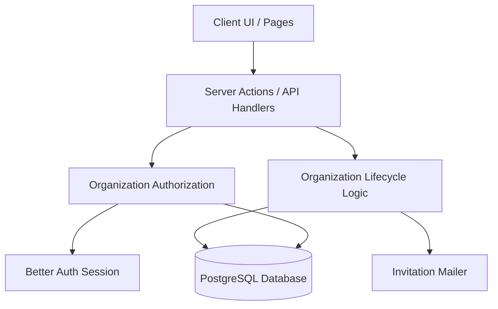
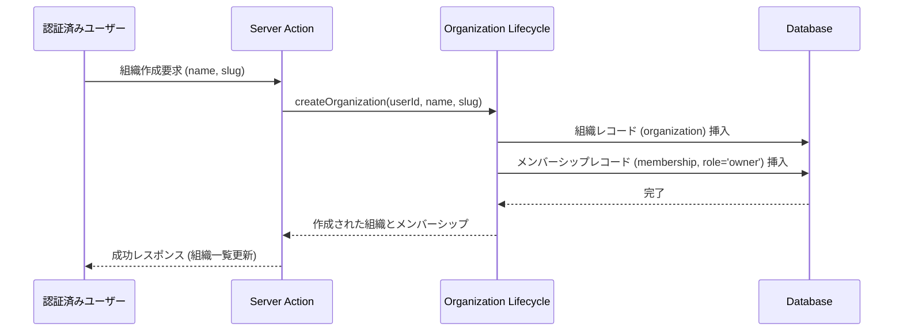
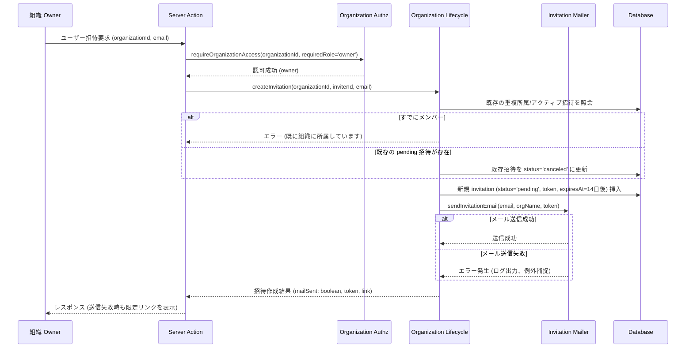
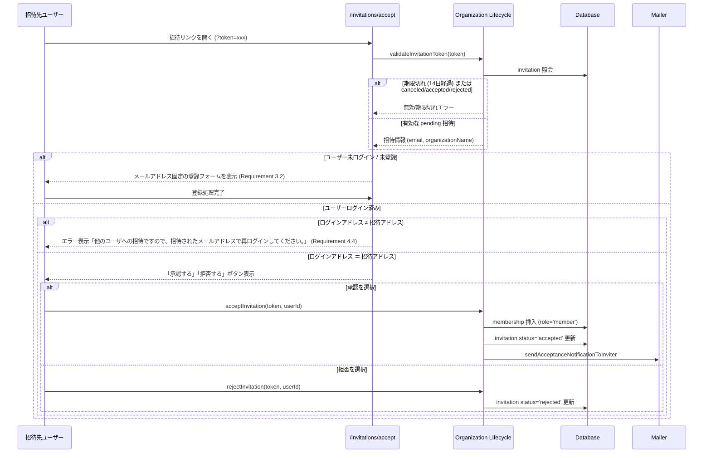

# Technical Design: Organization Lifecycle

## Overview

本設計は、認証済みユーザが組織を作成し、他のユーザ（既存登録済みおよび未登録）を組織へ招待・加入させる組織ライフサイクル機能を提供する。`5-organization-foundation` が提供する `organization` / `membership` スキーマおよび認可モジュール (`requireOrganizationAccess`) を基盤として利用し、組織の作成、招待の発行・有効期限管理、承諾・拒否・未登録者登録参加、招待履歴・招待先限定リンク、および所属組織・メンバー一覧表示を実現する。

### Goals

- 認証済みユーザによる新規組織の作成と作成者への `owner` ロール自動割り当て。
- `owner` によるメールアドレス指定の組織招待（14日間有効）と Nodemailer 経由のメール通知。
- 既存ユーザーによる招待の承諾（`member` として所属追加＆招待者通知）および拒否。
- 未登録ユーザーに対する招待先メールアドレス固定の登録フロー。登録完了後は既存ユーザーと同一の招待承諾画面へ遷移し、明示的な承諾・拒否操作を必須とする。
- 招待期限切れ、再招待による旧招待無効化、送信失敗時の招待先限定リンク手動送付機能。
- ログインアカウント不一致時の安全なエラー表示と再ログイン誘導（要件 4.4）。
- 組織メンバーによる所属組織一覧および自組織のメンバー一覧取得。

### Non-Goals

- 組織の一般公開検索や自己参加（サインアップ後の自由参加）。
- URL スラッグによるアクティブ組織のコンテキスト解決およびルーティングガード（`organization-context` が担当）。
- メンバーのロール変更、メンバーの脱退・除名・権限昇格（`organization-member-management` が担当）。
- 組織の削除・編集・休止。
- 組織に紐づく実業務データ（プロジェクト、リソース等）。

## Boundary Commitments

### This Spec Owns

- 組織の新規作成および初期 `owner` メンバーシップの生成。
- 招待レコード (`invitation`) の作成、トークン生成、有効期限（14日）チェック、ステータス遷移（`pending` / `accepted` / `rejected` / `expired` / `canceled`）。
- 招待通知メールおよび承諾通知メールの送信ロジック (`invitation-mailer.ts`)。招待先メールアドレスが既存アカウントか未登録かに応じて、ログイン導線／新規登録導線を出し分ける。
- 招待トークンの検証、未登録者のメアド固定登録による所属処理、別アカウントログイン時のガード。
- 組織メンバーによる所属組織一覧および所属組織のメンバー一覧の照会。
- `owner` による招待履歴および未受諾招待の限定リンク照会。

### Out of Boundary

- URL スラッグベースの組織コンテキスト解決および画面・ページレベルの認可ガード（`organization-context` で提供）。
- メンバーのロール変更、権限剥奪、組織からの削除（`organization-member-management` で提供）。
- 組織自体の削除や設定変更。

### Allowed Dependencies

- `src/db/schema.ts` の `organization`, `membership`, `user` スキーマおよび shared database (`src/db/index.ts`)。
- `src/lib/organization-authz.ts` の `requireOrganizationAccess` 認可関数。
- `src/lib/auth.ts` の Better Auth セッション取得と Nodemailer メール送信設定。

### Revalidation Triggers

- `invitation` テーブルのキー、トークン仕様、状態型が変更される場合。
- 招待受諾用 URL (`/invitations/accept?token=...`) のエンドポイント仕様が変更される場合。
- `requireOrganizationAccess` の成功・失敗戻り値の形式が変更される場合。

## Architecture

### Existing Architecture Analysis

`5-organization-foundation` により、`organization`, `membership` スキーマおよび `requireOrganizationAccess` が提供されている。既存の認証機能 (`src/lib/auth.ts`, Better Auth) ではユーザー取得やセッション取得が可能であり、Nodemailer 経由のメール送信も `auth.ts` 内で確立されている。本機能はこれらの上位に位置し、組織のライフサイクル操作と招待のデータ管理・メール送信を追加する。

### Architecture Pattern & Boundary Map



- **Selected pattern**: フルスタックモノリス（Server Actions / Server Services + Drizzle スキーマ）。
- **Domain boundaries**: 認可判定は `organization-authz` を利用し、招待・所属処理は `organization-lifecycle` モジュールに集約する。

### Technology Stack

| Layer | Choice / Version | Role in Feature | Notes |
| --- | --- | --- | --- |
| Frontend | React 19 / Next.js 16 App Router | 組織作成ダイアログ、招待フォーム、招待一覧、メンバー一覧 | Server/Client Components |
| Backend | Next.js Server Actions / TypeScript | 組織ライフサイクル操作の API 境界 | Strict Mode |
| Data | PostgreSQL 16 & Drizzle ORM | `invitation` テーブルの定義および状態遷移 | 加算的 migration |
| Mail | Nodemailer | 招待メールおよび承認完了メールの送信 | Mailpit / SMTP |
| Testing | Vitest | ライフサイクルロジックおよび状態遷移の単体テスト | TDD |

## File Structure Plan

### Directory Structure

```text
src/
├── db/
│   ├── schema.ts                            # invitation テーブル・Enum の追加
│   └── schema.organization-lifecycle.test.ts # invitation スキーマの契約テスト
├── lib/
│   ├── invitation-mailer.ts                 # 招待メール・承認通知メールの送信
│   ├── organization-lifecycle.ts            # 組織作成、招待、承認、拒否、一覧照会の集約ロジック
│   └── organization-lifecycle.test.ts       # ライフサイクル機能の単体・統合テスト
├── components/
│   ├── organization-create-dialog.tsx       # 組織作成ダイアログ
│   ├── organization-invite-form.tsx         # 組織招待フォーム
│   ├── organization-invitation-list.tsx     # 招待履歴および限定リンクコピーUI
│   └── organization-member-list.tsx         # メンバー一覧UI
└── app/
    ├── invitations/
    │   └── accept/
    │       └── page.tsx                     # 招待承諾・拒否・未登録者登録案内画面
    └── dashboard/
        └── page.tsx                         # 所属組織一覧・組織作成UIの組み込み
```

### Modified Files

- `src/db/schema.ts` — `invitationStatusEnum` (`pending`, `accepted`, `rejected`, `expired`, `canceled`) および `invitation` テーブルを定義。
- `src/app/dashboard/page.tsx` — 所属組織一覧表示と組織作成ボタンを組み込み。

## System Flows

### 組織作成フロー (Requirement 1)



### 招待発行フロー (Requirement 2 & 4 & 5)



### 招待承諾・拒否・未登録者登録フロー (Requirement 2, 3, 4)



## Requirements Traceability

| Requirement | Summary | Components | Interfaces | Flows |
|---|---|---|---|---|
| 1.1, 1.2, 1.3 | 組織の作成と Owner 付与 | OrganizationLifecycle | `createOrganization` | 組織作成フロー |
| 2.1, 2.2 | Owner による招待作成とメール通知 | OrganizationLifecycle, Mailer | `createInvitation` | 招待発行フロー |
| 2.3, 2.4 | 招待の承認・拒否と所属生成・招待者通知 | OrganizationLifecycle, Mailer | `respondToInvitation` | 招待承諾フロー |
| 2.5 | 重複所属の防止 | OrganizationLifecycle | `createInvitation` | 招待発行フロー |
| 3.1, 3.2, 3.3 | 未登録招待先のメールアドレス固定登録と招待承諾画面への遷移 | InvitationAcceptPage, AuthForm | `validateInvitationToken`, `respondToInvitation` | 招待承諾フロー |
| 4.1 | 招待の14日間有効期限 | Schema, OrganizationLifecycle | `expiresAt` check | 招待承諾フロー |
| 4.2 | 再招待時の旧招待無効化 | OrganizationLifecycle | `createInvitation` | 招待発行フロー |
| 4.3 | 無効・期限切れ招待の拒否 | OrganizationLifecycle | `validateInvitationToken` | 招待承諾フロー |
| 4.4 | 別アカウントログイン時のメッセージ・ガード | InvitationAcceptPage | `validateInvitationToken` | 招待承諾フロー |
| 5.1, 5.2 | Owner による招待履歴・限定リンク照会 | OrganizationLifecycle | `getInvitations` | 招待発行フロー |
| 5.3 | メール送信失敗時の未受諾維持と限定リンク表示 | OrganizationLifecycle, Mailer | `createInvitation` | 招待発行フロー |
| 5.4 | 非 Owner による招待履歴照会の拒否 | OrganizationAuthz, Lifecycle | `requireOrganizationAccess` | 招待発行フロー |
| 6.1 | 所属組織一覧の取得 | OrganizationLifecycle | `getUserOrganizations` | - |
| 6.2, 6.3 | 所属メンバー一覧の取得と非メンバー拒否 | OrganizationAuthz, Lifecycle | `getOrganizationMembers` | - |

## Components and Interfaces

### Server Services

#### OrganizationLifecycle Service (`src/lib/organization-lifecycle.ts`)

| Field | Detail |
|---|---|
| Intent | 組織作成、招待発行・検証・回答、組織/メンバー一覧照会のビジネスロジックを集約する |
| Requirements | 1.1-1.3, 2.1-2.5, 3.1-3.3, 4.1-4.4, 5.1-5.4, 6.1-6.3 |

##### Service Interface

```typescript
export interface CreateOrganizationInput {
  readonly headers: Headers;
  readonly name: string;
  readonly slug: string;
}

export interface CreateInvitationInput {
  readonly headers: Headers;
  readonly organizationId: string;
  readonly email: string;
}

export interface RespondToInvitationInput {
  readonly headers: Headers;
  readonly token: string;
  readonly accept: boolean;
}

export interface ValidateTokenResult {
  readonly valid: boolean;
  readonly reason?: 'not-found' | 'expired' | 'already-used' | 'canceled';
  readonly invitation?: {
    readonly id: string;
    readonly organizationId: string;
    readonly organizationName: string;
    readonly email: string;
    readonly role: 'owner' | 'member';
  };
}

export interface OrganizationLifecycle {
  createOrganization(input: CreateOrganizationInput): Promise<{
    readonly ok: boolean;
    readonly organization?: { id: string; name: string; slug: string };
    readonly error?: string;
  }>;

  createInvitation(input: CreateInvitationInput): Promise<{
    readonly ok: boolean;
    readonly invitation?: { id: string; email: string; token: string; inviteLink: string };
    readonly mailSent?: boolean;
    readonly error?: string;
  }>;

  validateInvitationToken(token: string): Promise<ValidateTokenResult>;

  respondToInvitation(input: RespondToInvitationInput): Promise<{
    readonly ok: boolean;
    readonly error?: string;
  }>;

  getInvitations(input: { readonly headers: Headers; readonly organizationId: string }): Promise<{
    readonly ok: boolean;
    readonly invitations?: Array<{
      id: string;
      email: string;
      role: string;
      status: string;
      inviteLink: string;
      createdAt: Date;
      expiresAt: Date;
    }>;
    readonly error?: string;
  }>;

  getUserOrganizations(headers: Headers): Promise<{
    readonly ok: boolean;
    readonly organizations?: Array<{
      id: string;
      name: string;
      slug: string;
      role: 'owner' | 'member';
      joinedAt: Date;
    }>;
    readonly error?: string;
  }>;

  getOrganizationMembers(input: { readonly headers: Headers; readonly organizationId: string }): Promise<{
    readonly ok: boolean;
    readonly members?: Array<{
      id: string;
      userId: string;
      userName: string;
      userEmail: string;
      displayName?: string | null;
      role: 'owner' | 'member';
      joinedAt: Date;
    }>;
    readonly error?: string;
  }>;
}
```

#### Invitation Mailer Service (`src/lib/invitation-mailer.ts`)

| Field | Detail |
|---|---|
| Intent | Nodemailer 経由での招待案内メール送信および承認時通知メール送信 |
| Requirements | 2.1, 2.3, 3.1 |

```typescript
export interface SendInvitationEmailParams {
  readonly toEmail: string;
  readonly organizationName: string;
  readonly inviterName: string;
  // Always points to /invitations/accept?token=... (never directly to
  // /login or the signup screen). This lets an invitee who is already
  // logged in with the matching email accept/reject immediately, without
  // being forced through a redundant re-login step. isExistingUser only
  // changes the email copy/CTA label (login-oriented vs signup-oriented).
  readonly actionLink: string;
  readonly isExistingUser: boolean;
}

export interface SendAcceptanceNotificationParams {
  readonly toEmail: string;
  readonly organizationName: string;
  readonly newMemberName: string;
  readonly newMemberEmail: string;
}

export async function sendInvitationEmail(params: SendInvitationEmailParams): Promise<boolean>;
export async function sendAcceptanceNotificationEmail(params: SendAcceptanceNotificationParams): Promise<boolean>;
```

## Data Models

### Domain Model & Invariants

1. **Organization**: 一意な ID、名前、一意なスラッグを持つ。
2. **Membership**: 1つの組織と1人のユーザーのバインディング（一意複合キー `[organizationId, userId]`）。ロールは `owner` または `member`。組織ごとの表示名 `displayName` (任意) を保持できる。
3. **Invitation**:
   - 有効期間は発行から14日間 (`expiresAt`)。
   - `status`: `pending` (未回答), `accepted` (承諾済み), `rejected` (拒否済み), `expired` (期限切れ), `canceled` (再招待等によるキャンセル)。
   - 同一組織・同一メールへの再招待時、以前の `pending` な招待は `canceled` に更新する。

### Physical Data Model (Drizzle Schema)

```typescript
export const invitationStatusEnum = pgEnum('invitation_status', [
  'pending',
  'accepted',
  'rejected',
  'expired',
  'canceled',
]);

export type InvitationStatus = (typeof invitationStatusEnum.enumValues)[number];

export const invitation = pgTable(
  'invitation',
  {
    id: text('id').primaryKey(),
    organizationId: text('organization_id')
      .notNull()
      .references(() => organization.id, { onDelete: 'cascade' }),
    email: text('email').notNull(),
    role: organizationRole('role').notNull().default('member'),
    token: text('token').notNull().unique(),
    status: invitationStatusEnum('status').notNull().default('pending'),
    inviterId: text('inviter_id')
      .notNull()
      .references(() => user.id, { onDelete: 'cascade' }),
    expiresAt: timestamp('expires_at').notNull(),
    createdAt: timestamp('created_at').notNull(),
    updatedAt: timestamp('updated_at').notNull(),
  },
  (table) => [
    index('invitation_organization_id_idx').on(table.organizationId),
    index('invitation_email_idx').on(table.email),
    index('invitation_token_idx').on(table.token),
  ],
);
```

## Error Handling

### Error Strategy
- **認証エラー (401)**: 未ログインユーザーが保護された API を呼び出した場合。ログイン画面へ遷移。
- **認可エラー (403)**: `member` ロールのユーザーが招待発行や履歴照会を行おうとした場合、または非メンバーが組織情報を要求した場合。
- **アカウント不一致エラー (要件 4.4)**: 招待リンクを開いたユーザーのログインメールアドレスと招待宛先が不一致の場合、画面上で「他のユーザへの招待ですので、招待されたメールアドレスで再ログインしてください。」と明示し、ログアウトボタン／再ログインリンクを表示。
- **招待無効エラー**: トークンが存在しない、有効期限切れ (14日超過)、すでに承諾/拒否/キャンセル済みの場合。理由を画面に明示。
- **メール送信エラー (要件 5.3)**: Mailer で例外が発生しても DB 上の招待レコードは作成・維持され、UI 上で「招待は作成されましたが、メール送信に失敗しました。以下のリンクをコピーして相手に共有してください」という警告メッセージと限定リンクを表示。

## Testing Strategy

### Unit Tests (`src/lib/organization-lifecycle.test.ts`)
- 組織作成時に正しいスラッグ・`owner` ロールでレコードが生成されること。
- `owner` 以外のユーザーによる招待作成が拒否されること。
- 既にメンバーとして所属しているメールアドレスへの招待作成が拒否されること。
- 同一メールアドレスへの再招待時、旧招待のステータスが `canceled` に更新されること。
- 期限切れ（14日経過）の招待トークンによる承諾が拒否されること。
- 招待承諾時に `membership` (`member`) が正しく生成され、招待状態が `accepted` に更新されること。
- 招待拒否時に所属が作成されず、招待状態が `rejected` に更新されること。

### Schema Contract Tests (`src/db/schema.organization-lifecycle.test.ts`)
- `invitation` テーブルのプライマリキー、外部キー制約 (cascade)、一意トークン制約、インデックス構造を検証。

### Component / Integration Tests
- 招待受諾画面 (`/invitations/accept`) における不一致アカウントメッセージ (要件 4.4) の描画検証。
- メールアドレス固定での未登録者登録誘導 UI の動作検証。
