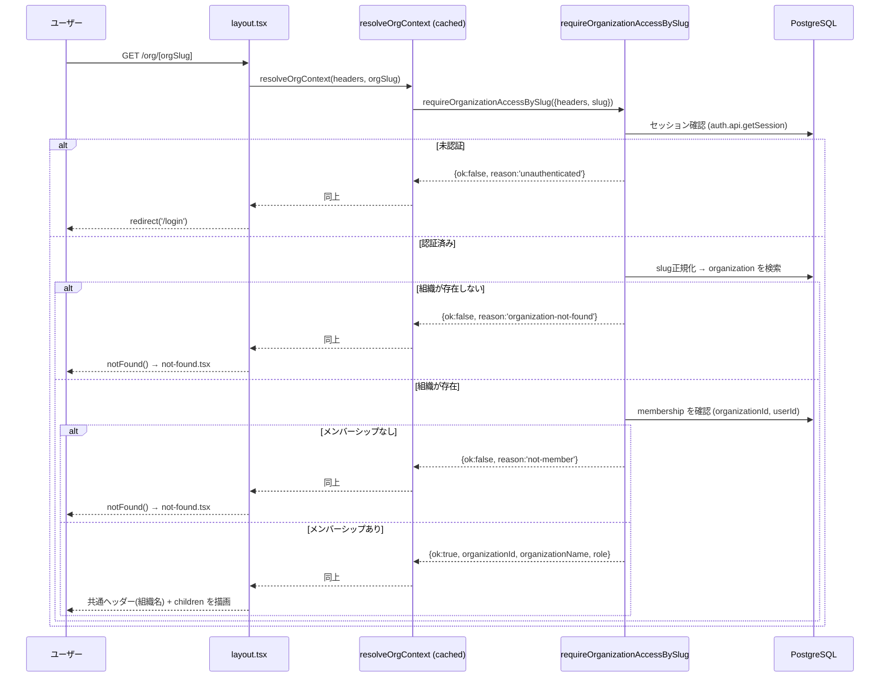

# Technical Design Document

## Overview

本機能は、組織メンバーが `/dashboard` または `/personal/organizations` で所属組織を選択し、URL の slug（`/org/[orgSlug]`）を唯一の情報源として組織コンテキストへ安全に到達できるようにする。認証済みかつ対象組織への所属が確認できたユーザにのみ、共通ヘッダーへ組織名を表示するコンテキスト画面を提供する。

**Users**: 既に組織に所属している `owner` / `member` が、複数の所属組織を切り替えながら組織固有の画面へ移動する際に利用する。

**Impact**: 現在 `/dashboard` に埋め込まれている組織一覧（`OrganizationList`）へ「組織を開く」導線を追加し、`/personal/organizations` と `/org/[orgSlug]` を新設する。既存の認可モジュール（`organization-authz.ts`）に slug 起点の並行エントリポイントを追加する。

### Goals
- `/dashboard` と `/personal/organizations` の両方で、所属組織一覧から `/org/[orgSlug]` への選択導線を提供する。
- `/org/[orgSlug]` の slug を唯一の情報源として組織を解決し、未認証・非所属・不正 slug を安全に判別する。
- `/org/[orgSlug]` 配下の共通ヘッダーに、現在アクセス中の組織名を常時表示する。

### Non-Goals
- 組織作成・招待の状態遷移（`6-organization-lifecycle` の既存範囲）
- 組織メンバーの権限変更・組織削除（`8-organization-member-management` の範囲）
- `/org/[orgSlug]` 配下でのメンバー一覧・招待管理 UI の新規配置や移設（`8-organization-member-management` が所有）
- 組織に紐づく業務データの取得・表示

## Boundary Commitments

### This Spec Owns
- `/dashboard` と `/personal/organizations` における「所属組織を選択して `/org/[orgSlug]` へ遷移する」導線。
- slug から組織を解決し、認証・所属を検証する認可エントリポイント（`requireOrganizationAccessBySlug`）。
- `/org/[orgSlug]` レイアウトの共通ヘッダー（組織名表示）と、404／未認証時のリダイレクト制御。
- `/org/[orgSlug]` の最小限のコンテキストページ（組織名・slug・自分のロールの表示）。

### Out of Boundary
- `/org/[orgSlug]` 配下のメンバー一覧・招待の開始/削除・ロール変更・組織削除 UI（`8-organization-member-management` が所有）。
- 招待の作成・承諾・拒否などの状態遷移ロジック（`6-organization-lifecycle` が所有、変更しない）。
- 組織・メンバーシップ・ロールのスキーマおよび基本認可判定（`5-organization-foundation` が所有、拡張のみ行う）。
- 組織に紐づく業務データの表示。

### Allowed Dependencies
- `src/db/schema.ts` の `organization` / `membership` テーブル（`5-organization-foundation` が定義、読み取りのみ）。
- `src/lib/organization-authz.ts` の既存 `requireOrganizationAccess` パターン（ロジックを共有ヘルパーとして再利用、シグネチャは変更しない）。
- `src/lib/organization-lifecycle.ts` の `getUserOrganizations`（`6-organization-lifecycle` が提供、選択 UI のデータソースとして利用）。
- Better Auth のセッション確認（`auth.api.getSession`）。

### Revalidation Triggers
- `organization.slug` の一意性制約や正規化規則（`trim().toLowerCase()`）が変更された場合。
- `requireOrganizationAccess` の失敗理由（`unauthenticated` / `organization-not-found` / `not-member` / `insufficient-role`）の意味やシグネチャが変更された場合。
- `membership` レコードの作成条件（承諾時のみ作成、というルール）が変更された場合、要件3.4の成立根拠を再確認する必要がある。
- `8-organization-member-management` が `/org/[orgSlug]` 配下にメンバー管理 UI を追加する際、本仕様の `layout.tsx` / `page.tsx` の責務分割との整合を再確認する。

## Architecture

### Existing Architecture Analysis
- 認可は Server Component / Server Action からの直接呼び出しパターンで統一されている（Next.js middleware は未導入）。`dashboard/page.tsx` が `auth.api.getSession()` を呼び未認証時に `redirect('/login')` する形が既存の保護ルートパターン。
- `organization-authz.ts` は「認証確認 → 組織存在確認 → メンバーシップ確認 → ロール確認」の順で判定し、`{ok:false, reason}` 形式で失敗理由を返す。本仕様はこのパターンを踏襲する。
- `getUserOrganizations()` は既に `{id, name, slug, role, joinedAt}` を返しており、選択 UI に追加のデータ取得ロジックは不要。

### Architecture Pattern & Boundary Map

```mermaid
flowchart TD
    A["/dashboard<br/>OrganizationList"] -->|組織を開く<br/>Link href=/org/slug| C[/org/[orgSlug]]
    B["/personal/organizations<br/>OrganizationSection"] -->|組織を開く| C
    C --> D["layout.tsx<br/>requireOrganizationAccessBySlug"]
    D -->|unauthenticated| E[redirect /login]
    D -->|organization-not-found or not-member| F[notFound → not-found.tsx]
    D -->|ok| G["共通ヘッダー(組織名) + page.tsx"]
```

**Architecture Integration**:
- 選択パターン: Server Component ガード + slug 起点の並行認可関数（既存パターンの延長）。
- ドメイン境界: 「選択導線（既存 UI への追加）」「slug 解決・認可（authz モジュール拡張）」「コンテキスト表示（新規ルート）」の3責務に分離。
- 既存パターン維持: `requireOrganizationAccess` の失敗理由 enum、Server Component でのセッション確認、Server Action 経由のデータ取得。
- 新規コンポーネントの根拠: `/org/[orgSlug]` は新設ルートのため layout/page/not-found が必須。slug 解決は既存関数と責務が異なるため新規関数として追加。
- Steering 準拠: 独自 Drizzle スキーマと Better Auth セッションの分離方針を維持し、認可判定はアプリケーション側モデル（`membership.role`）に基づく。

### Technology Stack

| Layer | Choice / Version | Role in Feature | Notes |
|-------|------------------|-----------------|-------|
| Frontend | Next.js 16 App Router (Server/Client Components) | `/org/[orgSlug]` ルート、選択 UI | 既存構成を踏襲 |
| Backend / Services | `src/lib/organization-authz.ts`, `organization-lifecycle.ts` | slug 解決・認可、組織一覧取得 | 既存モジュールを拡張・再利用 |
| Data / Storage | PostgreSQL 16, Drizzle ORM | `organization.slug` の一意解決 | スキーマ変更なし |
| Infrastructure / Runtime | Better Auth（セッションのみ） | 認証済みセッションの確認 | 変更なし |

## File Structure Plan

### Directory Structure
```
src/
├── app/
│   ├── org/
│   │   └── [orgSlug]/
│   │       ├── layout.tsx       # アクセス制御 + 共通ヘッダー（組織名表示）
│   │       ├── page.tsx         # 最小限のコンテキストページ（組織名/slug/ロール表示）
│   │       └── not-found.tsx    # 不正slug・非所属時の404画面
│   └── personal/
│       └── organizations/
│           └── page.tsx         # 認証ガード + OrganizationSection 再利用
├── lib/
│   └── organization-authz.ts    # requireOrganizationAccessBySlug を追加（既存関数は変更しない）
└── components/
    └── organization/
        └── organization-list.tsx  # 「組織を開く」リンクを追加
```

### Modified Files
- `src/lib/organization-authz.ts` — 非公開ヘルパー `checkMembershipAndRole` を抽出し、既存 `requireOrganizationAccess` から利用しつつ、新規 `requireOrganizationAccessBySlug`（slug 正規化 → 組織解決 → 同ヘルパー呼び出し）を追加する。
- `src/lib/organization-authz.test.ts` — 新規関数のテスト（成功、`unauthenticated`、`organization-not-found`、`not-member`、`insufficient-role`、slug の大文字小文字/空白正規化）を追加。
- `src/components/organization/organization-list.tsx` — 各組織カードに `/org/${org.slug}` へ遷移する「組織を開く」リンクを追加し、所属組織が0件の場合の案内文に「招待を待つ」旨も追記する（要件1.3）。既存のメンバー一覧/招待管理トグルはそのまま維持。
- `src/components/organization/organization-list.test.tsx` — 新規リンクの存在と遷移先 href、空状態メッセージの更新を検証するテストを追加。

### New Files
- `src/app/org/[orgSlug]/layout.tsx` — `requireOrganizationAccessBySlug` を呼び出し、`unauthenticated` は `/login` へリダイレクト、`organization-not-found` / `not-member` は `notFound()`、成功時は組織名を表示する共通ヘッダーと `children` を描画する。
- `src/app/org/[orgSlug]/page.tsx` — 同じ解決結果（`React.cache()` でメモ化）を使い、組織名・slug・自分のロールを表示する最小限のコンテキストカードを描画する。
- `src/app/org/[orgSlug]/not-found.tsx` — 「組織が見つからないか、所属していません」旨のメッセージと `/dashboard` へのリンクを表示する。
- `src/app/org/[orgSlug]/layout.test.tsx`, `page.test.tsx` — 認証/所属状態ごとの分岐（redirect / notFound / 表示）を検証。
- `src/app/personal/organizations/page.tsx` — `dashboard/page.tsx` と同様のセッション確認 + `redirect('/login')` ガードを行い、`OrganizationSection` を描画する。
- `src/app/personal/organizations/page.test.tsx` — 未認証時のリダイレクトと、認証済み時の `OrganizationSection` 描画を検証。
- `src/lib/organization-context.ts` — layout と page の双方から呼ばれる `resolveOrgContext(headers, slug)` を `React.cache()` でラップし、同一リクエスト内の重複 DB アクセスを避ける薄いラッパー。

## System Flows

### `/org/[orgSlug]` アクセス解決フロー



- `page.tsx` は `layout.tsx` と同一の `resolveOrgContext` を呼び出すが、`React.cache()` によりリクエスト内で DB アクセスは1回に集約される。
- `organization-not-found` と `not-member` は同一の `notFound()` 経路に合流させ、要件3.3 が求める「組織不存在時と同じ404画面」を自然に満たす。

## Requirements Traceability

| Requirement | Summary | Components | Interfaces | Flows |
|-------------|---------|------------|------------|-------|
| 1.1 | 所属組織だけを選択肢に表示 | `OrganizationList`, `OrganizationSection` | `getUserOrganizationsAction` | - |
| 1.2 | 選択で `/org/[orgSlug]` へ遷移 | `OrganizationList`（開くリンク追加） | Next.js `Link` | - |
| 1.3 | 所属組織0件時の導線案内 | `OrganizationList`（空状態メッセージ更新） | - | - |
| 2.1 | slugを唯一の情報源とする | `requireOrganizationAccessBySlug` | `organization.slug` 一意解決 | アクセス解決フロー |
| 2.2 | slugに対応する組織のコンテキスト表示 | `layout.tsx`, `page.tsx` | `resolveOrgContext` | アクセス解決フロー |
| 2.3 | 不正slugで404 | `layout.tsx`, `not-found.tsx` | `notFound()` | アクセス解決フロー |
| 2.4 | 共通ヘッダーに組織名を常時表示 | `layout.tsx` | - | アクセス解決フロー |
| 3.1 | 所属確認後にコンテキスト表示 | `requireOrganizationAccessBySlug` | - | アクセス解決フロー |
| 3.2 | 未認証は login へ | `layout.tsx` | `redirect('/login')` | アクセス解決フロー |
| 3.3 | 非所属は404（不存在と同一画面） | `layout.tsx`, `not-found.tsx` | `notFound()` | アクセス解決フロー |
| 3.4 | 未承認/拒否済み/期限切れ/無効な招待のみの場合は非表示 | `requireOrganizationAccessBySlug`（`membership` 存在確認） | - | アクセス解決フロー（membership が存在しないため `not-member` 経路に自然合流） |

## Components and Interfaces

| Component | Domain/Layer | Intent | Req Coverage | Key Dependencies (P0/P1) | Contracts |
|-----------|--------------|--------|--------------|--------------------------|-----------|
| `requireOrganizationAccessBySlug` | lib/authz | slugから組織を解決し認可判定する | 2.1, 2.2, 2.3, 3.1, 3.2, 3.3, 3.4 | `db`（P0）, `auth.api.getSession`（P0） | Service |
| `resolveOrgContext` | lib/context | リクエスト単位で認可解決をメモ化 | 2.2, 2.4 | `requireOrganizationAccessBySlug`（P0） | Service |
| `/org/[orgSlug]/layout.tsx` | app | 共通ヘッダー描画とアクセス制御 | 2.2, 2.3, 2.4, 3.1, 3.2, 3.3 | `resolveOrgContext`（P0） | State |
| `/org/[orgSlug]/page.tsx` | app | 最小限のコンテキスト表示 | 2.2, 2.4 | `resolveOrgContext`（P0） | State |
| `/org/[orgSlug]/not-found.tsx` | app | 404表示 | 2.3, 3.3 | - | State |
| `/personal/organizations/page.tsx` | app | 組織選択画面（dashboard相当） | 1.1, 1.2, 1.3 | `OrganizationSection`（P0） | State |
| `OrganizationList`（改修） | components/organization | 選択導線の追加 | 1.1, 1.2, 1.3 | `getUserOrganizationsAction`（P0） | State |

### lib/authz

#### `requireOrganizationAccessBySlug`

| Field | Detail |
|-------|--------|
| Intent | URL slug から組織を解決し、認証・所属・ロールを検証する |
| Requirements | 2.1, 2.2, 2.3, 3.1, 3.2, 3.3, 3.4 |

**Responsibilities & Constraints**
- slug を `trim().toLowerCase()` で正規化してから `organization` テーブルを検索する（`createOrganization` と同一の正規化規則）。
- 認証確認・メンバーシップ確認・ロール確認は既存 `requireOrganizationAccess` と共有する非公開ヘルパー（`checkMembershipAndRole`）に委譲し、判定ロジックの重複を避ける。
- `membership` レコードが存在しない場合（保留中/拒否済み/期限切れ/無効な招待のみの状態を含む）は `not-member` を返す。

**Dependencies**
- Inbound: `/org/[orgSlug]/layout.tsx`, `page.tsx`（P0）
- Outbound: `db`（Drizzle, P0）, `auth.api.getSession`（P0）

**Contracts**: Service [x]

##### Service Interface
```typescript
export interface RequireOrganizationAccessBySlugInput {
  readonly headers: Headers;
  readonly slug: string;
  readonly requiredRole?: OrganizationRole;
}

export type OrganizationAccessBySlug =
  | {
      readonly ok: true;
      readonly organizationId: string;
      readonly organizationName: string;
      readonly organizationSlug: string;
      readonly userId: string;
      readonly role: OrganizationRole;
    }
  | {
      readonly ok: false;
      readonly reason: 'unauthenticated' | 'organization-not-found' | 'not-member' | 'insufficient-role';
    };

export async function requireOrganizationAccessBySlug(
  input: RequireOrganizationAccessBySlugInput
): Promise<OrganizationAccessBySlug>;
```
- Preconditions: `headers` は呼び出し元の Server Component/Action が受け取ったリクエストヘッダー。
- Postconditions: `ok: true` の場合のみ組織コンテキストの描画が許可される。
- Invariants: 失敗理由は既存 `OrganizationAccess`（ID起点）と同じ4種類の enum を維持する。

### app/org/[orgSlug]

#### `resolveOrgContext`

| Field | Detail |
|-------|--------|
| Intent | `layout.tsx` と `page.tsx` 間で認可解決結果をリクエスト単位に共有する |
| Requirements | 2.2, 2.4 |

**Responsibilities & Constraints**
- `React.cache()` でラップし、同一リクエスト内で同じ `(headers, slug)` に対する呼び出しは1回のDBアクセスに集約する。
- `requireOrganizationAccessBySlug` の戻り値をそのまま返す（追加の変換は行わない）。

**Contracts**: Service [x]

##### Service Interface
```typescript
export const resolveOrgContext = cache(
  async (headers: Headers, slug: string) =>
    requireOrganizationAccessBySlug({ headers, slug })
);
```

## Error Handling

### Error Strategy
既存の `organization-authz.ts` の failure-reason パターン（`{ok:false, reason}`）をそのまま踏襲し、`layout.tsx` 側で reason ごとに具体的な画面遷移へマッピングする。

### Error Categories and Responses
- **未認証（`unauthenticated`）**: `/login` へ `redirect()`。
- **組織不存在（`organization-not-found`）/ 非所属（`not-member`）**: 情報を一切表示せず `notFound()` を呼び、共通の `not-found.tsx`（「組織が見つからないか、所属していません」+ `/dashboard` へのリンク）を表示する。両者を同一画面にすることで、要件3.3（「組織不存在時と同じ404画面」）を満たす。
- **所属組織が0件（選択画面側）**: エラーではなく案内表示（組織作成導線 + 招待を待つ旨のメッセージ）。

### Monitoring
既存のログ方針（`console.error` によるサーバーサイドエラーログ、直近のPR対応で追加した認証系エラーログの慣習）を踏襲し、`requireOrganizationAccessBySlug` の各失敗理由発生時に `console.error('[requireOrganizationAccessBySlug] ...')` を出力する。

## Testing Strategy

- **Unit Tests**:
  - `requireOrganizationAccessBySlug`: 成功、`unauthenticated`、`organization-not-found`、`not-member`、`insufficient-role`、slug正規化（大文字/前後空白）の各ケース。
  - `resolveOrgContext`: 同一リクエスト内でのメモ化動作（モックDBの呼び出し回数検証）。
- **Integration Tests**:
  - `/org/[orgSlug]/layout.tsx`: 未認証時の `/login` リダイレクト、非所属時の `notFound()` 呼び出し、所属済み時の組織名ヘッダー描画。
  - `/personal/organizations/page.tsx`: 未認証時のリダイレクト、認証済み時の `OrganizationSection` 描画。
  - `OrganizationList`: 「組織を開く」リンクの href 検証、空状態メッセージの更新内容。
- **E2E/UI Tests**（既存のテスト方針に準拠する範囲で）:
  - `/dashboard` で組織を選択 → `/org/[slug]` へ遷移 → 組織名がヘッダーに表示される一連のフロー。
  - 所属していない slug へ直接アクセス → 404画面が表示される。
