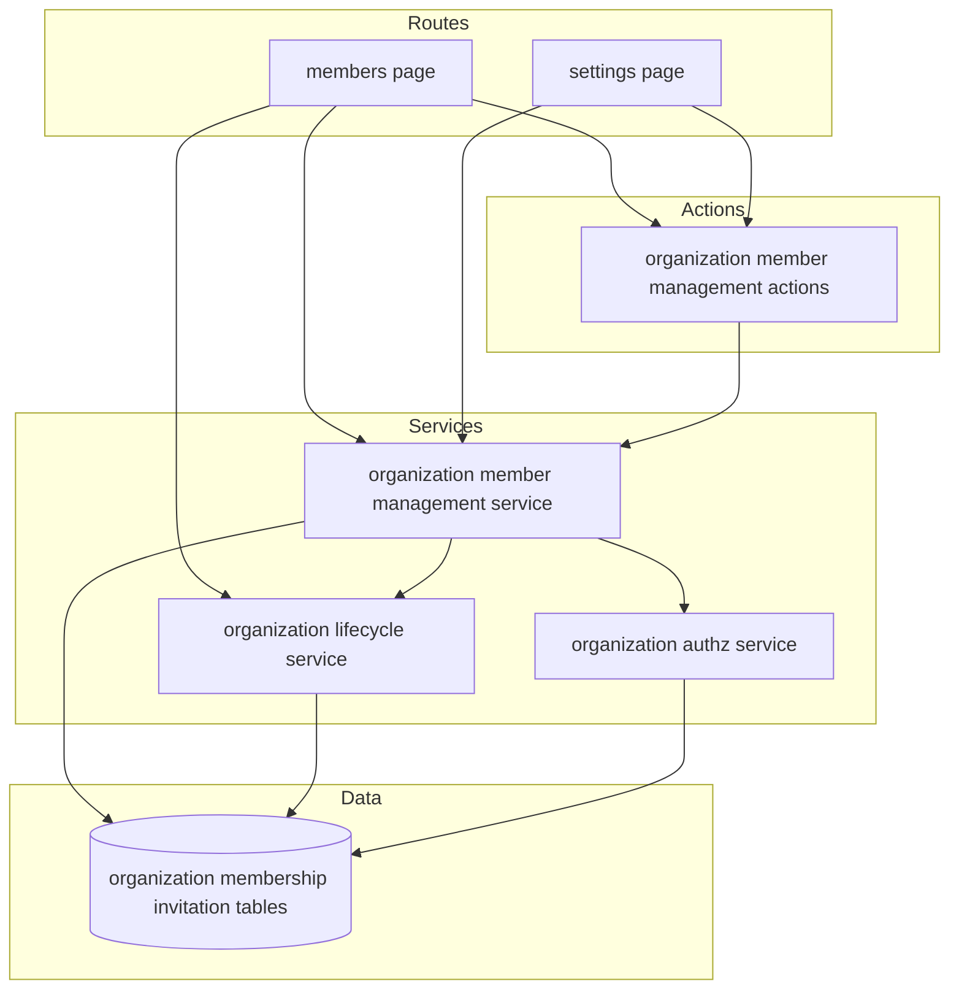
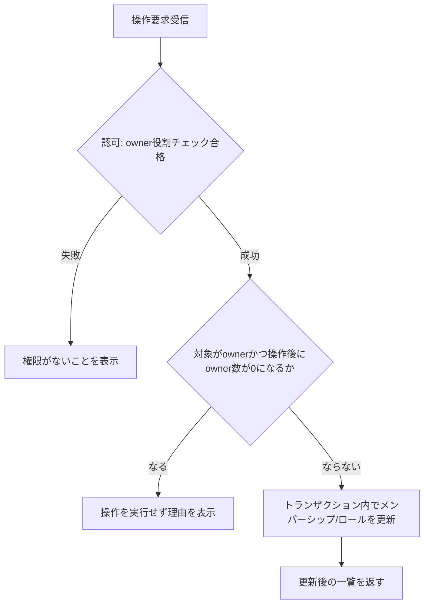

# Design Document

## Overview

**Purpose**: 本機能は、組織の owner が所属メンバーと保留中の招待を安全に管理し（招待開始・メンバー削除・ロール変更・招待キャンセル・組織削除）、全メンバーが自身の所属状況を確認・解消できるようにする。  
**Users**: 組織に所属する全ユーザー（member と owner）が `/dashboard/org/[orgSlug]/members` と `/dashboard/org/[orgSlug]/settings` を通じて利用する。  
**Impact**: `organization-context`（spec 7）が確立した所属済みコンテキストの内側に、初めての書き込み系操作（削除・更新）を追加する。既存の `organization-lifecycle`（spec 6）が提供する招待作成・招待履歴閲覧の UI コンポーネントを配線し直し、owner 向けの操作を追加する。  

### Goals
- owner が対象組織のメンバーを削除・ロール変更でき、保留中の招待を削除できる。
- 常に1人以上の owner を維持する不変条件を、削除・ロール変更・自己脱退・自己降格のすべての操作で一貫して強制する。
- member/owner が自身の表示名・ロールと（owner の場合）メールアドレスを含むメンバー一覧を閲覧できる。
- owner が組織・全メンバーシップ・全未受諾招待を削除できる。
- すべての変更操作について、UI の表示制御に依存せずサーバー側で認可を検証する。

### Non-Goals
- 招待の作成・承認・拒否・有効期限・通知送信ロジックの変更（organization-lifecycle が引き続き所有）。
- 組織コンテキストのルーティング・所属ガードの変更（organization-context / organization-authz が引き続き所有）。
- `owner`/`member` 以外のロールの追加。
- 監査ログ、課金、実業務データの可視性制御。
- 他ユーザーによる強制退去のリアルタイム反映（次回アクセス時のサーバー側検証で代替する。詳細は `research.md` の Design Decisions を参照）。

## Boundary Commitments

### This Spec Owns
- `/dashboard/org/[orgSlug]/members` と `/dashboard/org/[orgSlug]/settings` の画面と操作。
- メンバー削除、ロール変更、保留中招待の削除、組織削除、自己脱退のサーバー側ロジックと認可判定。
- 「常に1人以上の owner を維持する」不変条件の実装と、それを侵す操作の拒否。
- メンバー一覧のロール別メールアドレス可視性（owner のみ閲覧可）。

### Out of Boundary
- 招待レコードの作成・トークン発行・有効期限判定・メール送信（`organization-lifecycle` が所有、変更しない）。
- 組織コンテキストの解決 (`resolveOrgContext`) とルーティングガード (`layout.tsx`)（`organization-context` が所有、変更しない）。
- 認可基盤の中核 (`requireOrganizationAccess` / `requireOrganizationAccessBySlug`)（`organization-authz` が所有、変更しない。既存の `requiredRole` パラメータをそのまま利用する）。
- 組織・メンバーシップ・招待テーブルのスキーマ変更（既存の `onDelete: 'cascade'` 制約をそのまま利用し、スキーマ変更は行わない）。

### Allowed Dependencies
- `requireOrganizationAccessBySlug`（`src/lib/organization-authz.ts`）— 全ミューテーション・閲覧関数の認可判定に使用する。
- `resolveOrgContext`（`src/lib/organization-context.ts`）— ページのアクセス制御は layout に委ね、ページ内では `resolveOrgContext` が返す `role` を条件分岐にのみ利用する。
- `getInvitations` / `getOrganizationMembers`（`src/lib/organization-lifecycle.ts`）— 既存の読み取りクエリをそのまま再利用する（`getOrganizationMembers` はロール別フィルタのため本機能側でラップする）。
- `organization` / `membership` / `invitation` テーブル（`src/db/schema.ts`）— 既存スキーマをそのまま利用し、変更しない。

### Revalidation Triggers
- `requireOrganizationAccessBySlug` の入出力契約（`OrganizationAccessBySlug` の形状や失敗理由）が変わる場合。
- `organization` / `membership` / `invitation` テーブルの外部キー制約（特に `onDelete: 'cascade'`）が変更される場合、組織削除ロジックの再検証が必要。
- `getOrganizationMembers` / `getInvitations` の戻り値の形状が変わる場合、本機能のラッパーとメール可視性フィルタの再検証が必要。

## Architecture

### Existing Architecture Analysis
- `organization-authz.ts`（spec 5）が `requireOrganizationAccess` / `requireOrganizationAccessBySlug` を提供し、`organizationId` または `slug` とオプションの `requiredRole` で認可判定を行う。本機能はこれをそのまま呼び出す。
- `organization-lifecycle.ts`（spec 6）は招待の作成・状態遷移・履歴取得・既存メンバー一覧取得を提供するが、メンバー削除・ロール変更・組織削除の操作を一切持たない（design.md で明示的に "organization-member-management で提供" と将来へ委譲されている）。
- `organization-context.ts` / `dashboard/org/[orgSlug]/layout.tsx`（spec 7）が、所属していないユーザーやログインしていないユーザーを 404 / ログインへ振り分ける門番として機能済み。本機能はこの門番の内側にのみ新規ルートを追加する。

### Architecture Pattern & Boundary Map



**Architecture Integration**:
- 選択パターン: 既存の「ページ（Server Component）→ Server Action → ドメインサービス関数 → Drizzle」という spec 5/6/7 と同一の層構造をそのまま踏襲する。
- ドメイン境界: 新規の `organization-member-management` サービスがミューテーションと閲覧フィルタを所有し、`organization-lifecycle` の招待作成・履歴機能は変更せず呼び出すのみ。
- 既存パターン維持: Server Action は薄いラッパー（`headers()` 取得 + サービス呼び出し）のみを行う既存規約（`src/app/actions/organization.ts`）を継続する。
- 新規コンポーネントの理由: メンバー削除・ロール変更・招待キャンセル・組織削除・自己脱退という、既存モジュールが提供しない5つの新しい書き込み操作を1つの凝集したサービスに集約するため。
- Steering 準拠: `src/lib/` にサーバー専用ロジックを配置し、Server Action は `src/app/actions/` に配置する既存規約（`docs/steering/structure.md`）に従う。

### Technology Stack

| Layer | Choice / Version | Role in Feature | Notes |
|-------|------------------|-----------------|-------|
| Frontend | Next.js 16 (App Router, Server/Client Components), TypeScript strict | メンバー管理・設定画面のレンダリングと操作 | 既存の `src/app/dashboard/org/[orgSlug]` 配下に追加 |
| Backend | Next.js Server Actions + `src/lib/organization-member-management.ts` | ミューテーションと閲覧フィルタの実行、認可判定 | 既存の `organization-authz.ts` / `organization-lifecycle.ts` を呼び出すのみで変更しない |
| Data | PostgreSQL 16, Drizzle ORM | `organization` / `membership` / `invitation` テーブルへの読み書き | スキーマ変更なし。既存の `onDelete: cascade` を利用 |

## File Structure Plan

### Directory Structure
```
src/
├── lib/
│   └── organization-member-management.ts   # 新規: メンバー削除・ロール変更・招待キャンセル・自己脱退・組織削除・閲覧フィルタ
├── app/
│   ├── actions/
│   │   └── organization-member-management.ts   # 新規: 上記サービスの薄い Server Action ラッパー
│   └── dashboard/org/[orgSlug]/
│       ├── members/
│       │   └── page.tsx                     # 新規: メンバー一覧 + owner 向け招待/削除/ロール変更/招待キャンセルUI
│       └── settings/
│           └── page.tsx                     # 新規: 自己脱退（全ロール）+ owner 限定の自己降格・組織削除
└── components/organization/
    ├── member-list.tsx                      # 変更: メール表示をロール条件付きに、owner向け削除/ロール変更ボタンを追加
    ├── invitation-manager.tsx                # 変更: 保留中招待にキャンセルボタンを追加
    ├── leave-organization-button.tsx         # 新規: 確認ダイアログ付きの自己脱退ボタン（唯一のownerの場合はエラー表示）
    └── organization-danger-zone.tsx          # 新規: owner限定の自己降格・組織削除（確認ダイアログ付き）
```

### Modified Files
- `src/components/organization/member-list.tsx` — `userEmail` を任意項目に変更し、`viewerRole` / `onRemoveMember` / `onChangeRole` props を追加して owner 専用の操作行を描画する。
- `src/components/organization/invitation-manager.tsx` — `pending` 状態の招待行に「取り消す」ボタンと `onCancelInvitation` コールバックを追加する。
- `src/app/dashboard/org/[orgSlug]/page.tsx` — メンバー管理・設定画面への導線リンクを追加する（既存のコンテキスト表示自体は変更しない）。

## Requirements Traceability

| Requirement | Summary | Components | Interfaces | Flows |
|-------------|---------|------------|------------|-------|
| 1.1 | member はメンバーの表示名とロールを閲覧できる | MembersPage, MemberList, `listMembersForViewer` | Service | メンバー一覧取得フロー |
| 1.2 | owner はメールアドレスも閲覧できる | MembersPage, MemberList, `listMembersForViewer` | Service | メンバー一覧取得フロー |
| 1.3 | 非所属ユーザーには何も表示しない | `listMembersForViewer`, `requireOrganizationAccessBySlug` | Service | メンバー一覧取得フロー |
| 2.1 | owner が招待を開始する | MembersPage, InvitationManager | 既存 `createInvitationAction` | 招待開始フロー（導線のみ） |
| 2.2 | owner がメンバーを削除する | MemberList, `removeMember` | Service | メンバー削除フロー |
| 2.3 | owner が member を owner に変更する | MemberList, `changeMemberRole` | Service | ロール変更フロー |
| 2.4 | owner が owner を member に変更する | MemberList, `changeMemberRole` | Service | ロール変更フロー |
| 2.5 | owner が0人になる操作を拒否する | `ensureOwnerRemainsAfterChange`（共有ガード） | Service | ロール変更/削除フロー |
| 2.6 | member による管理操作を拒否する | `requireOrganizationAccessBySlug`（`requiredRole: 'owner'`） | Service | 全ミューテーションフロー共通 |
| 2.7 | owner が保留中の招待を削除する | InvitationManager, `cancelInvitation` | Service | 招待キャンセルフロー |
| 2.8 | member による招待削除を拒否する | `cancelInvitation`（owner限定認可） | Service | 招待キャンセルフロー |
| 3.1 | member が自己脱退する | SettingsPage, LeaveOrganizationButton, `leaveOrganization` | Service | 自己脱退フロー |
| 3.2 | 複数owner組織で owner が自己脱退する | SettingsPage, LeaveOrganizationButton, `leaveOrganization` | Service | 自己脱退フロー |
| 3.3 | 唯一の owner の脱退を拒否する | `ensureOwnerRemainsAfterChange`（共有ガード） | Service | 自己脱退フロー |
| 4.1 | 複数owner組織で owner が自己を member に変更する | SettingsPage, OrganizationDangerZone, `changeMemberRole` | Service | ロール変更フロー |
| 4.2 | 唯一の owner の自己降格を拒否する | `ensureOwnerRemainsAfterChange`（共有ガード） | Service | ロール変更フロー |
| 5.1 | owner が組織を削除する（メンバーシップ・未受諾招待も削除） | SettingsPage, OrganizationDangerZone, `deleteOrganization` | Service | 組織削除フロー |
| 5.2 | member による組織削除を拒否する | `requireOrganizationAccessBySlug`（`requiredRole: 'owner'`） | Service | 組織削除フロー |
| 5.3 | 組織削除が完了しない場合は状態を維持する | `deleteOrganization`（try/catchで既存状態を維持） | Service | 組織削除フロー |

## System Flows

### メンバー削除・ロール変更・自己脱退の共通ガードフロー



- 自己脱退（3.1〜3.3）は `requiredRole` を `member` として認可し、対象を常に呼び出し本人（`session.user.id`）に固定した上で同じガードを通す。
- 他メンバーへのロール変更・削除（2.2〜2.5）は `requiredRole: 'owner'` で認可し、対象は自分以外の任意のユーザーを指定できる。
- 自己降格（4.1〜4.2）はサービス層としては `changeMemberRole` を自分自身の `userId` を対象に呼び出す形で同じガードを通すが、**UI 上は `OrganizationDangerZone`（Settings画面）からのみ実行可能とする**。`MemberList` は自分の行に対する操作ボタンを描画しない（対象が自分自身の場合はボタン非表示。詳細は Components and Interfaces / MemberList を参照）。これにより、同一操作に対するUIの実装場所が一意に定まる。
- ガード判定と更新は同一の `db.transaction` 内で行い、同時実行時の owner 数不整合を防ぐ。

## Components and Interfaces

| Component | Domain/Layer | Intent | Req Coverage | Key Dependencies (P0/P1) | Contracts |
|-----------|--------------|--------|--------------|--------------------------|-----------|
| `organization-member-management` service | Backend / Domain | メンバー削除・ロール変更・招待キャンセル・自己脱退・組織削除・閲覧フィルタを提供 | 1.1-1.3, 2.2-2.8, 3.1-3.3, 4.1-4.2, 5.1-5.3 | `organization-authz`(P0), `organization-lifecycle`(P1), DB(P0) | Service |
| `organization-member-management` actions | Backend / Server Action | 上記サービスの薄いラッパー | 2.2-2.8, 3.1-3.3, 4.1-4.2, 5.1-5.3 | サービス(P0) | Service |
| MembersPage | Frontend / Route | メンバー一覧と owner 向け操作の表示 | 1.1-1.3, 2.1-2.8 | `listMembersForViewer`(P0), `getInvitationsAction`(P1) | State |
| SettingsPage | Frontend / Route | 自己脱退・owner限定の自己降格・組織削除の表示 | 3.1-3.3, 4.1-4.2, 5.1-5.3 | サービス(P0) | State |
| MemberList（変更） | Frontend / UI | 他メンバー行の表示とowner操作ボタン（自分の行には操作ボタンを表示しない） | 1.1-1.3, 2.2-2.4 | MembersPage(P1) | State |
| InvitationManager（変更） | Frontend / UI | 招待作成導線・招待履歴・キャンセル操作 | 2.1, 2.7 | MembersPage(P1) | State |
| LeaveOrganizationButton | Frontend / UI | 自己脱退の確認と実行 | 3.1-3.3 | SettingsPage(P1) | State |
| OrganizationDangerZone | Frontend / UI | owner限定の自己降格・組織削除の確認と実行 | 4.1-4.2, 5.1-5.3 | SettingsPage(P1) | State |

### Backend / Domain

#### organization-member-management service

| Field | Detail |
|-------|--------|
| Intent | メンバー・招待に対する owner 限定の変更操作と、ロール別に安全な閲覧結果を提供する |
| Requirements | 1.1, 1.2, 1.3, 2.2, 2.3, 2.4, 2.5, 2.6, 2.7, 2.8, 3.1, 3.2, 3.3, 4.1, 4.2, 5.1, 5.2, 5.3 |

**Responsibilities & Constraints**
- 全ての公開関数はまず `requireOrganizationAccessBySlug` を呼び出し、認可に失敗した場合は即座に失敗理由を返す（ミューテーションの実行前に必ず認可判定を行う）。
- owner 数の不変条件（常に1以上）を検証する内部ガード `ensureOwnerRemainsAfterChange` を、削除・ロール変更・自己脱退の全操作から共有する。このガードは対象組織の `membership` 行を `SELECT ... FOR UPDATE` で明示的に行ロックしてから owner 数を数え、同一トランザクション内で更新を確定させる（同時実行時に owner 0人化を防ぐ。詳細は Concurrency Control を参照）。
- 組織削除は `organization` 行を削除するのみとし、`membership` / `invitation` は既存の `onDelete: cascade` 制約に委ねる（アプリケーション層で個別削除を行わない）。
- メンバー一覧の閲覧は既存の `getOrganizationMembers`（`organization-lifecycle`）を呼び出した後、viewerRole が `owner` でない場合は各要素の `userEmail` を除去してから返す。この結果（`ViewableMember[]`）はページ側で1度だけ取得し、`MemberList` へ props として渡す。`MemberList` はメンバー取得を自ら行わない（Critical Issue 1 対応、Components and Interfaces / MemberList を参照）。

**Concurrency Control（owner 最小数不変条件の保護）**
- `removeMember` / `changeMemberRole` / `leaveOrganization` は以下の手順を単一の `db.transaction` 内で実行する:
  1. `tx.select({ id: membership.id, role: membership.role }).from(membership).where(eq(membership.organizationId, organizationId)).for('update')` を発行し、Drizzle の標準クエリビルダーが提供する `.for('update')` 節（生SQLを書かずにチェーン可能）で対象組織の全 `membership` 行を行ロックする（PostgreSQL の行ロックにより、同一組織に対する同時トランザクションは後続がブロックされ、直列化される）。
  2. ロック取得後の行データを使って、操作後の owner 数を計算する（対象行の削除/ロール変更をシミュレートしてから `role = 'owner'` の件数を数える）。
  3. 操作後の owner 数が 0 になる場合は `ROLLBACK` 相当（例外throw等でtransaction関数から抜ける）し、`last-owner-protection` を返す。
  4. 0 にならない場合は同一トランザクション内で `UPDATE`/`DELETE` を実行し、コミットする。
- この手順により、2つの同時リクエスト（例: 2人のownerが同時に相手を降格しようとする）が競合しても、後続のトランザクションは先行トランザクションのロック解放を待ってから最新の行データで再評価するため、owner が0人になることはない。
- Drizzle での実装は `db.transaction(async (tx) => { ... })` 内で標準クエリビルダーの `.for('update')` を用いる（`tx.execute(sql\`...\`)` のような生SQL実行は使用しない。`docs/steering/tech.md` の「明示的な標準クエリビルダーを使用する」規約に準拠する。`db:generate`／スキーマ変更は不要、クエリレベルの対応のみ）。

**Dependencies**
- Inbound: `organization-member-management` Server Actions — 各操作の呼び出し元（P0）
- Outbound: `requireOrganizationAccessBySlug`（`organization-authz`）— 認可判定（P0）
- Outbound: `getOrganizationMembers` / `getInvitations`（`organization-lifecycle`）— 既存の読み取りクエリの再利用（P1）
- External: PostgreSQL（Drizzle `db.transaction`）— 整合性のあるガード判定と更新（P0）

**Contracts**: Service [x] / API [ ] / Event [ ] / Batch [ ] / State [ ]

##### Service Interface
```typescript
export type OrganizationRole = 'owner' | 'member';

export interface MemberManagementActionInput {
  readonly headers: Headers;
  readonly slug: string;
}

export type MemberManagementFailureReason =
  | 'unauthenticated'
  | 'organization-not-found'
  | 'not-member'
  | 'insufficient-role'
  | 'last-owner-protection'
  | 'invitation-not-pending'
  | 'not-found'
  | 'system-failure'; // DB接続失敗等、想定外の例外が発生した場合（既存状態は維持される）

export interface ViewableMember {
  readonly id: string;
  readonly userId: string;
  readonly userName: string;
  readonly userEmail?: string; // owner が閲覧者の場合のみ設定される
  readonly displayName?: string | null;
  readonly role: OrganizationRole;
  readonly joinedAt: Date;
}

export type ListMembersResult =
  | { readonly ok: true; readonly organizationId: string; readonly viewerRole: OrganizationRole; readonly members: readonly ViewableMember[] }
  | { readonly ok: false; readonly reason: MemberManagementFailureReason };

export type MemberMutationResult =
  | { readonly ok: true; readonly members: readonly ViewableMember[] }
  | { readonly ok: false; readonly reason: MemberManagementFailureReason };

export type LeaveOrganizationResult =
  | { readonly ok: true }
  | { readonly ok: false; readonly reason: MemberManagementFailureReason };

export type CancelInvitationResult =
  | { readonly ok: true }
  | { readonly ok: false; readonly reason: MemberManagementFailureReason };

export type DeleteOrganizationResult =
  | { readonly ok: true }
  | { readonly ok: false; readonly reason: MemberManagementFailureReason };

export interface OrganizationMemberManagementService {
  listMembersForViewer(input: MemberManagementActionInput): Promise<ListMembersResult>;
  removeMember(input: MemberManagementActionInput & { readonly targetUserId: string }): Promise<MemberMutationResult>;
  changeMemberRole(
    input: MemberManagementActionInput & { readonly targetUserId: string; readonly newRole: OrganizationRole }
  ): Promise<MemberMutationResult>;
  cancelInvitation(input: MemberManagementActionInput & { readonly invitationId: string }): Promise<CancelInvitationResult>;
  leaveOrganization(input: MemberManagementActionInput): Promise<LeaveOrganizationResult>;
  deleteOrganization(input: MemberManagementActionInput): Promise<DeleteOrganizationResult>;
}
```
- Preconditions: `headers` は認証済みセッションを含む可能性がある生の `Headers`。`slug` は URL パスセグメントそのもの（正規化は `requireOrganizationAccessBySlug` 内部で実施済みのものを再利用）。
- Postconditions: `ok: true` の場合、DB の状態は要求された変更を確定して反映している。`ok: false` の場合、DB は要求前の状態から変化しない。
- Invariants: 任意の時点で対象組織の `membership` 行のうち `role = 'owner'` は1件以上存在する（削除された組織を除く）。

**Implementation Notes**
- Integration: `removeMember` / `changeMemberRole` / `leaveOrganization` は `db.transaction` 内で対象メンバーシップ行を行ロック相当の `SELECT ... FOR UPDATE` 的な直列実行（Drizzle トランザクション内での select→判定→update）で処理し、同時実行による owner 数不整合を防ぐ。
- Validation: `changeMemberRole` の `newRole` は `'owner' | 'member'` のみ許可し、それ以外の値は型レベルで排除する。
- Risks: 同時に複数の owner 変更リクエストが競合した場合、`SELECT ... FOR UPDATE` による行ロックで後続トランザクションが先行トランザクションのコミットまでブロックされ、直列に owner 数を再評価してから確定させるため、最終的に owner 0人になることはない（詳細は Concurrency Control を参照）。行ロック待ちが長時間化するリスクはあるが、対象は単一組織内の少数行の更新であり許容範囲とする。

### Backend / Server Action

#### organization-member-management actions

| Field | Detail |
|-------|--------|
| Intent | `organization-member-management` service を呼び出す薄い Server Action 群 |
| Requirements | 2.2, 2.3, 2.4, 2.7, 3.1, 3.2, 4.1, 5.1 |

**Responsibilities & Constraints**
- `headers()` を取得してサービス関数へ委譲するのみ。ビジネスロジックを持たない（既存の `src/app/actions/organization.ts` と同じ規約）。

**Dependencies**
- Inbound: MembersPage / SettingsPage / 各クライアントコンポーネント（P0）
- Outbound: `organization-member-management` service（P0）

**Contracts**: Service [x] / API [ ] / Event [ ] / Batch [ ] / State [ ]

**Implementation Notes**
- Integration: 関数シグネチャは `(slug: string, ...) => Promise<Result>` とし、クライアントコンポーネントから直接呼び出せるようにする。

### Frontend / Route

#### MembersPage (`src/app/dashboard/org/[orgSlug]/members/page.tsx`)

| Field | Detail |
|-------|--------|
| Intent | メンバー一覧を表示し、owner には招待開始・削除・ロール変更・招待キャンセルの操作を提供する |
| Requirements | 1.1, 1.2, 1.3, 2.1, 2.2, 2.3, 2.4, 2.7 |

**Implementation Notes**
- Integration: `resolveOrgContext` の結果（`organizationId`, `role`）を `listMembersForViewer` 呼び出しの引数として渡し、owner の場合のみ `getInvitationsAction` を追加で呼び出す。取得した `ViewableMember[]` を `MemberList` へ、招待一覧を `InvitationManager` へ、それぞれ `members` / `invitations` props としてそのまま渡す（`MemberList` と `InvitationManager` はいずれも自ら取得を行わない。詳細は Components and Interfaces / MemberList, InvitationManager を参照）。
- Integration: 削除・ロール変更・招待キャンセルはいずれも Server Action 成功後に Next.js の `router.refresh()` を呼び出し、`MembersPage`（Server Component）を再実行させて最新の `members` / `invitations` を再取得・再描画する。クライアント側では一覧データを state として保持しない（`MemberList` / `InvitationManager` の props は常に最新の Server Component 実行結果に追従する）。
- Validation: サーバー側の認可が最終判定であり、本ページの `role` に基づく表示制御は補助的なものである。
- Risks: 該当なし（既存パターンの踏襲）。

#### SettingsPage (`src/app/dashboard/org/[orgSlug]/settings/page.tsx`)

| Field | Detail |
|-------|--------|
| Intent | 自己脱退（全ロール）と owner 限定の自己降格・組織削除を提供する |
| Requirements | 3.1, 3.2, 4.1, 5.1 |

**Implementation Notes**
- Integration: `resolveOrgContext` が返す `role` に基づき、`OrganizationDangerZone`（owner限定セクション）の表示を切り替える。
- Validation: 自己降格・組織削除ボタンはサーバー側でも `requiredRole: 'owner'` を再検証する。

### Frontend / UI

#### MemberList（変更）

| Field | Detail |
|-------|--------|
| Intent | 親（MembersPage）から渡された `ViewableMember[]` を表示し、owner向けの「他メンバーに対する」削除・ロール変更操作を提供する。自らメンバー情報を取得しない。自分自身に対する降格操作は提供しない（`OrganizationDangerZone` が単独で担う） |
| Requirements | 1.1, 1.2, 1.3, 2.2, 2.3, 2.4 |

**Component Contract**
```typescript
export interface MemberListProps {
  readonly members: readonly ViewableMember[]; // MembersPage が listMembersForViewer から取得し、既にロール別フィルタ済みのデータを渡す
  readonly viewerRole: OrganizationRole;
  readonly viewerUserId: string; // 自分の行を判定し、自分自身には操作ボタンを描画しないために使用する
  readonly onRemoveMember: (targetUserId: string) => Promise<MemberMutationResult>;
  readonly onChangeRole: (targetUserId: string, newRole: OrganizationRole) => Promise<MemberMutationResult>;
}
```

**Implementation Notes**
- Integration: 既存実装は内部で `getOrganizationMembersAction` を呼び出して独自にメンバーを取得しているが、これを廃止する。`MemberList` は `members` props をそのまま描画するだけの表示コンポーネントへ変更し、データ取得責務を完全に `MembersPage` 側へ移す（`useEffect` によるフェッチを削除）。これにより、`viewerRole` が `owner` でない場合に `userEmail` が props レベルで既に存在しないことをコンポーネントツリー上で保証できる（Critical Issue 1 対応）。
- Integration: `member.userId === viewerUserId` の行では削除・ロール変更ボタンを描画しない（自分自身に対する操作は `OrganizationDangerZone` に一本化し、`MemberList` 経由では実行できないようにする。4.1/4.2 の実装場所の重複を避けるための境界）。
- Integration: `userEmail` は `string | undefined` とし、値が存在する行のみメールアドレスを描画する（値の有無は `listMembersForViewer` が既に決定済み）。`viewerRole === 'owner'` のときのみ操作ボタン列を描画する（UI側の表示制御は補助であり、最終的な可否はサーバー側の `requireOrganizationAccessBySlug` が担う）。
- Integration: 削除・ロール変更成功後は、`onRemoveMember`/`onChangeRole` の戻り値 (`MemberMutationResult`) で成否のみを判定し、成功時は `router.refresh()` を呼び出して `MembersPage`（Server Component）を再実行させる（`MemberList` 自身は一覧データを state として保持・再フェッチしない。MembersPage の Implementation Notes を参照）。
- Validation: 削除・ロール変更ボタン押下時は確認ダイアログを表示してから `onRemoveMember` / `onChangeRole` を呼び出す。
- Risks: 既存のテスト（`member-list.test.tsx`）は内部フェッチ（`getOrganizationMembersAction` のモック）を前提に書かれているため、props 駆動型への変更に伴い全面的な書き換えが必要。

#### InvitationManager（変更）

| Field | Detail |
|-------|--------|
| Intent | 招待作成フォームと招待履歴表示に加え、保留中招待のキャンセル操作を提供する |
| Requirements | 2.1, 2.7 |

**Implementation Notes**
- Integration: 招待一覧は `MembersPage` が `getInvitationsAction` で取得した結果を `invitations` props として受け取り、`InvitationManager` 自身は招待一覧を取得しない（`MemberList` と同様、`MembersPage` を唯一のデータ取得元とする設計上の一貫性のため）。
- Integration: `status === 'pending'` の行にのみ「招待を取り消す」ボタンを描画し、押下時に `cancelInvitationAction` を呼び出す。成功時は `router.refresh()` を呼び出して `MembersPage` を再実行させ、最新の招待一覧を再取得する（`InvitationManager` 自身は再フェッチしない）。
- Validation: キャンセル失敗時（`invitation-not-pending` 等）はエラーメッセージを表示し、一覧はそのまま維持する。

#### LeaveOrganizationButton（新規）

| Field | Detail |
|-------|--------|
| Intent | 自身の組織からの脱退を確認し実行する |
| Requirements | 3.1, 3.2, 3.3 |

**Implementation Notes**
- Integration: 確認ダイアログで意図を明示させた上で `leaveOrganizationAction` を呼び出し、成功時は `/dashboard/personal/organizations` へ遷移する。
- Validation: `last-owner-protection` エラーの場合は「別のメンバーを owner に変更する必要があります」というメッセージを表示する。

#### OrganizationDangerZone（新規）

| Field | Detail |
|-------|--------|
| Intent | owner限定の自己降格・組織削除を確認し実行する（自己降格 4.1/4.2 のUIは本コンポーネントのみが提供し、`MemberList` は自分の行の操作ボタンを表示しない） |
| Requirements | 4.1, 4.2, 5.1, 5.2, 5.3 |

**Implementation Notes**
- Integration: 「自分をmemberに変更」と「組織を削除」をそれぞれ独立した確認ダイアログ付きボタンとして提供する。組織削除成功時は `/dashboard/personal/organizations` へ遷移する。
- Validation: 自己降格は `last-owner-protection` エラーメッセージ、組織削除失敗は「削除できませんでした。もう一度お試しください」を表示する。

## Data Models

### Domain Model
- 既存の集約（`organization` を集約ルートとし、`membership` と `invitation` が従属エンティティ）をそのまま利用する。新しいエンティティ・値オブジェクトは導入しない。
- 不変条件（新規）: 「削除されていない組織は、常に `role = 'owner'` の `membership` を1件以上持つ」。この不変条件は `ensureOwnerRemainsAfterChange` によってのみ強制される。

### Logical Data Model
- スキーマ変更なし。`membership.organizationId` と `invitation.organizationId` は既に `organization.id` を `onDelete: 'cascade'` で参照しているため、組織削除時のカスケード削除は追加実装なしで機能する（詳細は `research.md` を参照）。

## Error Handling

### Error Strategy
既存の `organization-lifecycle.ts` / `organization-authz.ts` と同じ `{ ok: boolean, reason/error }` 形式の判別可能なユニオン型で結果を返し、例外はサービス層内で捕捉して失敗結果に変換する。

### Error Categories and Responses
- **認可エラー（`unauthenticated` / `not-member` / `insufficient-role`）**: 「権限がありません」を表示し、操作を実行しない。
- **不変条件違反（`last-owner-protection`）**: 「少なくとも1人の owner が必要です。別のメンバーを owner に変更してください」を表示し、操作を実行しない。
- **状態エラー（`invitation-not-pending` / `not-found`）**: 「対象の招待は既に処理済みか存在しません」を表示し、一覧を再取得する。
- **システムエラー（DB接続失敗等）**: `system-failure` を返す。「操作が完了しませんでした。もう一度お試しください」を表示し、既存状態を維持する（5.3 に対応）。

## Testing Strategy

- **Unit Tests**（`organization-member-management.ts`）:
  - `ensureOwnerRemainsAfterChange` が唯一の owner を対象にした降格・削除・脱退を拒否し、複数owner存在時は許可することを検証する。
  - `removeMember` / `changeMemberRole` / `leaveOrganization` が `db.transaction` 内で `.for('update')` を伴うロック取得クエリを先行実行してから owner 数判定・更新を行うことを、モック化した `db`（既存テストの `vi.mock('@/db', ...)` パターンを踏襲）に対する呼び出し順序・引数の検証（`select().from().where().for('update')` が `update`/`delete` より先に呼ばれること）で確認する。本テストは同時実行そのものを実DBで再現するものではなく、ロック取得→判定→更新という実装順序が設計通りであることの静的検証である点に注意する（実際の同時実行下での直列化効果は、行ロックが PostgreSQL の標準機能であることに基づく設計上の保証とし、本リポジトリに実DB統合テスト基盤が存在しないため自動テストの対象外とする。将来的に実DB統合テスト基盤を導入する場合は本項目を差し替える）。
  - `listMembersForViewer` が owner 閲覧時のみ `userEmail` を含み、member 閲覧時は含まないことを検証する。
  - `cancelInvitation` が `pending` 以外の状態を拒否し、`pending` のみキャンセルできることを検証する。
  - `deleteOrganization` が owner以外からの呼び出しを拒否し、owner呼び出し時に組織行が削除されることを検証する。
- **Integration Tests**:
  - MembersPage が member ロールではメールアドレス非表示・操作ボタン非表示、owner ロールではメールアドレス表示・操作ボタン表示となることを、実際の `page.tsx` + `MemberList` + `InvitationManager` を合成して検証する。特に `MemberList` が独自にメンバー取得を行わず、`MembersPage` から渡された `members` props のみを描画することを確認する（`MemberList` へメール付きデータを渡した場合とメールなしデータを渡した場合の両方をテストし、コンポーネント自身がフィルタ漏れを起こさないことを検証する）。
  - 組織削除後に `resolveOrgContext` を再実行すると `organization-not-found` を返す（カスケード削除の実効性を確認する）。
- **E2E/UI Tests**:
  - owner がメンバーを削除するとメンバー一覧から即座に消えることを確認する。
  - member が唯一の owner に対してロール変更ボタンを操作できない（ボタン自体が表示されない、または操作がサーバー側で拒否される）ことを確認する。
  - 唯一の owner が「組織から脱退」または「自分をmemberに変更」を試みるとエラーメッセージが表示され、操作が実行されないことを確認する。
